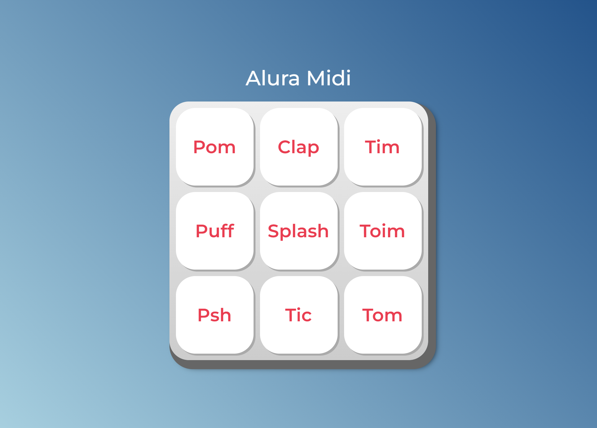

# Javascript-web

>Javascript-web

Projeto de um toca sons feito com auxilios do curso Alura. 
HTML e CSS prontos do curso, sendo treinado apenas javascript nesse curso.

[🔗Clique aqui para acessar](https://luan010z.github.io/Javascript-web-curso/)

## 🛠️Tecnologias 

- Javascript

## 🌹Contato

luaviduedo@gmail.com